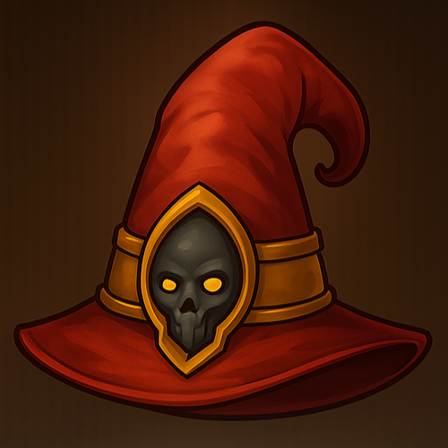
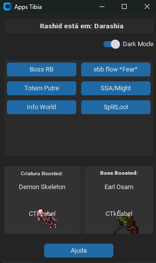
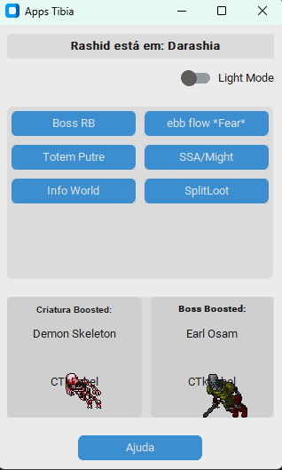
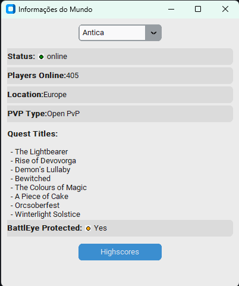

# 🚀 Apps Tibia

Uma coleção de ferramentas úteis para jogadores de Tibia, construídas com Python.

<div style="display: flex; flex-direction: row; align-items: center;">
    
    
    
    
</div>

## Visão Geral

Este aplicativo oferece diversas funcionalidades para auxiliar jogadores de Tibia em suas aventuras. Atualmente, inclui as seguintes ferramentas:

* **Informação do Rashid:** Acompanhe a localização diária do NPC Rashid.
* **Boosted Creatures e Bosses:** Veja qual criatura e boss estão boosted a cada dia.
* **Boss RB:** Timer para fazer a rotação do knight com rp com maior facilidade.
* **ebb flow *Fear*:** Timer para você poder acompanhar a maré e não se afogar. ;D
* **Totem Putre:** Timer para você não tomar o tottem.
* **SSA/Might:** Coloque seu SSA e Might maiores para você não perder de subir eles.
* **Info World:** Visualize informações sobre os servidores do Tibia.
* **SplitLoot:** Uma ferramenta para auxiliar na divisão de loot em grupo.

## Varias Funcionalidades para suas Hunts

### Informação do Rashid

Na tela inicial, você pode ver a localização atual do NPC Rashid, que muda diariamente. Uma imagem do Rashid também é exibida.

### Boosted Creatures e Bosses

A tela inicial também mostra qual criatura e boss estão recebendo o bônus diário, juntamente com suas imagens.

### Totem Putre

O "Totem Putre" é uma sobreposição na tela que exibe uma direção (Norte, Leste, Sul, Oeste) e um timer de 5 segundos. A direção muda automaticamente ao final do timer.

### Info World

Ao clicar no botão "Info World", uma nova janela se abrirá com informações sobre o mundo do Tibia.

### SplitLoot

A ferramenta "SplitLoot" auxilia na divisão de itens e moedas coletadas em grupo.

## Instalação

1.  **Pré-requisitos:** Certifique-se de ter o Python 3 instalado no seu sistema.
2.  **Clonar o Repositório:** `git clone https://github.com/dolthub/dolt` (se você estiver usando Git) ou baixe o código fonte.
3.  **Criar um Ambiente Virtual (Recomendado):**
    ```bash
    python -m venv .venv
    source .venv/bin/activate  # No Linux/macOS
    .venv\Scripts\activate  # No Windows
    ```
4.  **Instalar as Dependências:**
    ```bash
    pip install -r requirements.txt
    ```
    (Certifique-se de ter criado o `requirements.txt` com todas as dependências, incluindo `customtkinter`, `Pillow`, `requests`, `pytz`, e `winsound`.)
5.  **Executar o Aplicativo:**
    ```bash
    python main.py
    ```

## Créditos

Este aplicativo utiliza dados da seguinte API:
* [TibiaData] - (https://tibiadata.com/) (https://github.com/TibiaData)
